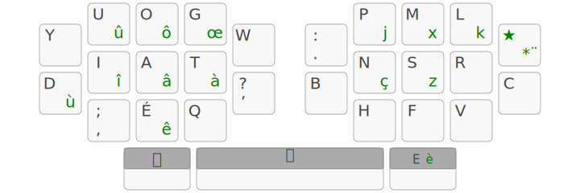
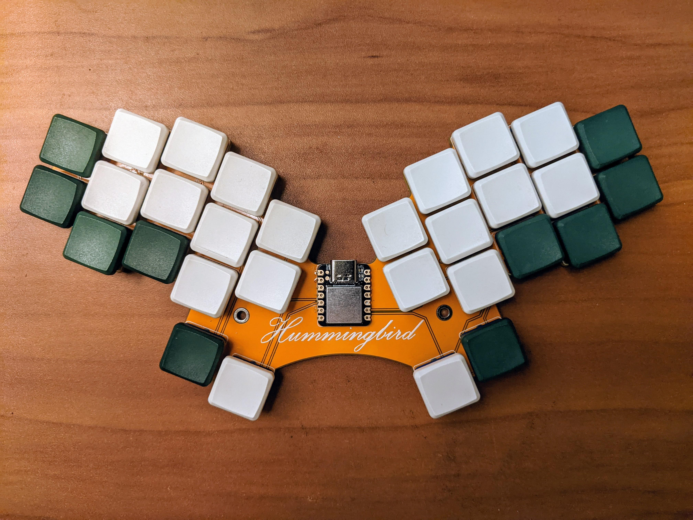

+++
title = "Hypergol"
url = "/hypergol"

[params]
footer = "outillé par [x-keyboard](https://onedeadkey.github.io/x-keyboard)"
+++

Une disposition et configuration de clavier aussi efficace qu’expérimentale !

:::{.highlight style="max-width: 32em;"}
- [Principe de la disposition]
- [La géométrie « Hummingbird »]
- [Le [E]{.kbd} et « touche magique » sous un pouce]
- [Les auto-fills]
- [Les « combos étendus »]
- [« C’est où qu’on signe ? »]
:::

Principe de la disposition
--------------------------------------------------------------------------------

Hypergol est un projet de disposition de clavier qui cherche à incorporer les
fonctionalités des claviers mécaniques programmables au sein de la disposition.
À l’heure actuelle, on ne s’interdit aucune de ces fonctionnalités : si c’est
*techniquement faisable* et que ça fait progresser l’ergonomie ou
l’optimisation de la disposition, alors on y a droit.

La disposition est implémentée grâce à un pilote [Kanata] ou [QMK] prévu pour être
utilisé sur un ordinateur en Ergo‑L.

Pour accélérer le développement de la dispo, nous utilisons un [brute-forceur]
maison, qui ne cherche pas à concevoir la meilleure disposition possible sur la
base d’une note globale hasardeuse, mais liste toutes les dispositions
possibles qui adhèrent à des critères simples (pas moins de 12% de charge sur
un index, pas plus de 0.2% de SFU sur un auriculaire…). On reste sur la méthode
d’optimisation classique des Ergonautes, mais ça accélère le travail de
recherche (surtout avec les fonctionnalités d’Hypergol qui rendent la
conception encore plus compliquée).

Attention : ce brute-forceur est un projet personnel inachevé du concepteur
d’Hypergol (Nuclear-Squid). La qualité du code est affreuse, et nous sommes en
train de le réécrire pour pouvoir implémenter de nouvelles fonctionnalités.

La géométrie « Hummingbird »
--------------------------------------------------------------------------------

Chez les Ergonautes, nous sommes convaincu·e·s des apports de la philosophie
[1DFH] en terme de confort et d’ergonomie. Cependant, il reste des touches
assez inconfortables dans le pavé de 3x10 central, comme les touches [Z]{.kbd},
[B]{.kbd}, [N]{.kbd} et [/]{.kbd} (sur un clavier ergonomique avec un gros
stagger, comme le Ferris).

:::{style="display: flex; justify-content: center"}
{width="25em"}
:::

Retirer 4 touches sur le clavier nous force donc à trouver de nouvelles places
pour les 4 lettres les moins fréquentes en français et anglais (`z`, `x`, `k`
et `j`), et pour ça, nous avons décidé de les placer sur la touche typo. On
considère que l’effort nécessaire pour taper ces lettres en deux touches est
négligeable par rapport à l’emplacement où ces lettres peuvent être placées, et
les ciseaux qui peuvent exister.

Il reste encore à savoir comment gérer proprement les touches manquantes en
[AltGr]{.kbd}, on travaille sur la question.

Le [E]{.kbd} et « touche magique » sous un pouce
--------------------------------------------------------------------------------

Puisque nous avons prévu la disposition pour des claviers programmables, alors
on peut se permettre de mettre des lettres sous les pouces. Le `e` étant la
lettre la plus fréquente en français et anglais, c’est celle-ci qui a été
retenue. Nous avons cependant remarqué qu’avoir le `e` sous le pouce
transforme beaucoup de roulements en alternances (avec un pouce), ce qui baisse
drastiquement le taux de roulements de la disposition. On compte faire des
recherches pour trouver la lettre optimale à cette position.

Passer une lettre sous un pouce permet de récupérer une place dans le pavé de
3x10 pour le `é` ; et puisque nous n’avons plus besoin de mettre le tiret sous
le `e` comme en Ergo‑L, on peut le mettre derrière la touche typo et repasser
l’apostrophe typographique en direct. Cela permet de réduire drastiquement
l’usage de cette touche typo, qui passe de ~4% à ~1% en français.

La « touche magique » (inspirée de [Magic Sturdy], et marqué par un `⛧` dans la
l’image de la dispo) est une touche dont le comportement dépend de la touche
précédente — un peu comme l’inverse d’une touche morte. Elle se comporte comme
une touche « [alt repeat] » de QMK : elle répète les symboles fréquemment
doublés et fait un autre symbole sur le même doigt pour les autres. L’objectif
de cette touche est d’éliminer totalement (ou presque) les SKB et SFB.

Par exemple, `ui` est un SFB qui a 0,7 % de fréquence en français, donc après un
`u`, la touche magique insère un `i`. De nombreux SFB sont *intentionnellement*
insérés dans la disposition pour qu’ils soient corrigés par cette touche
magique. Cela permet d’obtenir un score de SFU très bas (estimé à 0,3 %
en français et 0,4 % en anglais) tout en se laissant assez de marge de manœuvre
pour limiter les ciseaux, LSB et mauvaises redirections.

La touche magique agit comme une touche repeat par défaut, sauf pour les
lettres suivantes :

|       |     |     |     |     |     |     |      |     |     |     |     |     |               |
| ----- | --- | --- | --- | --- | --- | --- | ---  | --- | --- | --- | --- | --- | ---           |
| Prev  | `A` | `C` | `D` | `G` | `H` | `I` | `Q`  | `U` | `V` | `É` | `’` | `Y` | [Space]{.kbd} |
| Magic | `O` | `★` | `Y` | `T` | `.` | `,` | `U’` | `I` | `R` | `A` | `T` | `D` | `E`           |

### Les configurations de pouces recommandées

Bien que la dispo soit proposée avec une configuration de pouces précise, vous
êtes libre d’adapter cette configuration comme bon vous semble. Il y a cependant
quelques pièges à éviter.

Nous recommandons d’utiliser la configuration d’[Arsenik] ou [Selenium]
(suivant le nombre de touches de pouce) pour les actions en hold. En tap, nous
recommandons de placer la touche magique sur le pouce opposé du `e` (car il est
fréquemment doublé en anglais) et sur le même pouce que l’espace (pour éviter
les SFB `e` -> `espace`). Idéalement, l’espace devrait être accessible par les
deux pouces pour pouvoir faire un enchaînement `magic` -> `espace` sans avoir
un SFB ou SKB.

Si vous avez 4 touches sous les pouces, une bonne option sur la nouvelle touche
est de rajouter un « one-time-shift » (l’équivalent touche morte d’un shift),
afin de ne plus avoir d’erreurs de timing avec les lettres en majuscules.

Malheureusement, avoir une lettre fréquemment doublée sous un pouce peut rendre
la configuration des pouces compliquée : devoir mettre la touche magique sous
le même pouce que l’espace nous force à avoir des configurations complexes et
peu fiables pour totalement éliminer les SKB et SFK de pouce (qu’on a remarqué
être particulièrement inconfortables) et profiter pleinement des touches de
pouces disponibles (par exemple, temporairement transformer le one-time-shift
en espace après une pression de la touche magique).

Avoir espace et one-time-shift d’un côté et une lettre (non doublée) et magic
de l’autre permettrait d’éliminer ces soucis de configuration. Nous travaillons
sur cette question, mais la solution peut prendre encore du temps.

Les auto-fills
--------------------------------------------------------------------------------

Les auto-fills sont une fonctionnalité exclusive à Hypergol, leur objectif est
d’éliminer les mauvaises redirections et d’économiser quelques touches.

### Un exemple concret

Une façon de comprendre le concept de cette fonctionnalité est de regarder le
fonctionnement de la touche `Qu`.

En français comme en anglais, le `Q` étant quasiment *toujours* suivi par un `u`,
une façon d’économiser des gestes serait donc d’utiliser une touche qui écrit
directement `qu`. Mais cela peut causer des problèmes, notamment pour écrire
`Qatar`, `cinq` ou commencer une phrase par un `q` (puisque shift + `qu` donne
`QU` et non `Qu`). Pour éviter ces écueils, on a recours à des auto-fills
plutôt qu’à une touche `Qu`.

Une pression sur la touche `q` va immédiatement écrire un `q` et surveiller
la touche suivante. Si la touche suivante fait partie de `aeio’é`, alors on
rajoute un `u` juste avant d’écrire la lettre voulue (et si la touche ne fait
pas partie de la liste, alors on continue comme si de rien n’était). On peut
donc facilement écrire `Que` ou `cinq` sans problème. Ça reste plus compliqué
d’écrire `Qatar` mais pour l’instant, on considère que faire typo -> `q` insère
un `q` sans l’auto-fill.

### Une définition plus formelle

Si un roulement sur les lettres quelconques `a` et `c` a une fréquence
d’apparition négligeable, alors on peut s’en servir pour taper un auto-fill
`abc`. Cela permet à la fois d’économiser une touche mais aussi de limiter les
mauvaises redirections.

Par exemple, dans la version actuelle d’Hypergol, on a une mauvaise redirection
sur `you` (en anglais). Mais puisque le bigramme `yu` n’existe pratiquement pas,
on peut utiliser un auto-fill pour écrire `you` en tapant `yu`, et ainsi
transformer une mauvaise redirection en roulement intérieur.

Les auto-fills sont nés en cherchant une meilleure implémentation de la touche
`qu`, et ce n’est que plus tard que nous avons trouvé cet usage pour `you`.
Hypergol ne profite donc pas encore pleinement des possibilités que cela ouvre.

Les « combos étendus »
--------------------------------------------------------------------------------

Les « combos étendus » sont une autre fonctionnalité exclusive à Hypergol, et
c’est probablement la partie la plus complexe de la disposition. Cette
fonctionnalité permet de transformer la dispo en un hybride entre un clavier
standard et un clavier de sténotypie.

L’idée est que l’on peut taper un combo (deux touches spécifiques actionnées en
même temps) pour écrire un mot ou morceau de mot. Comme pour les auto-fills, la
touche suivante va être surveillée ; mais cette fois, au lieu de rajouter une
seule lettre, on rentre dans une machine à états qui va écrire le reste du mot
et potentiellement continuer la séquence.

Par exemple, appuyer sur [S]{.kbd} et [F]{.kbd} (de Qwerty) en même temps va
écrire `the`, et donne accès aux extensions suivantes :

:::{ style="width: 80%; text-align: center; margin: auto" }
|         |        |         |         |           |           |
|   ---   | ---    | ---     | ---     | ---       | ---       |
| lettre  | `F`    | `N`     | `S`     | `R`       | `L`       |
| mot     | `they` | `there` | `their` | `they’re` | `they’ll` |
:::

(Comme pour les auto-fills, écrire n’importe quelle autre lettre va sortir de
la machine à états et écrire la touche comme si de rien n’était.)

À l’heure actuelle, c’est le seul combo étendu de la dispo. Il sert surtout de
« proof of concept » et bien que l’expérience soit satisfaisante, nous n’en
avons pas encore rajouté d’autres : il reste des parties plus critiques à
régler avant ça.

« C’est où qu’on signe ? »
--------------------------------------------------------------------------------

Attention ! Hypergol est en plein développement et n’est pas encore utilisable
au quotidien : il y a des bugs dans les pilotes, notre analyseur ne sait pas
gérer ce type de disposition, il manque des fonctionnalités dans beaucoup
d’applis/frameworks pour claviers programmables que l’on doit implémenter
nous-mêmes, il faut travailler sur le [brute-forceur] maison pour qu’il puisse
repérer les mauvaises redirections (et proposer des auto-fills), la disposition
peut encore radicalement bouger — et nous ne sommes à l’abri ni de découvrir
une nouvelle fonctionnalité, ni de remettre en cause une fonctionnalité existante.

Pour le dire autrement, nous ne vous recommandons ***PAS*** Hypergol pour
l’instant, car :

- la disposition n’est pas stable ;
- la disposition est très difficile à apprendre ;
- les pilotes ne fonctionnent pas complètement ;
- les pilotes sont délicats à installer ;
- la keymap QMK ne passe pas sur un clavier avec un micro-contrôleur AVR (la
  keymap est *trop lourde* pour ce type de claviers…)
- on n’a pas de keymaps ZMK, Kmonad, Keyd, Keyberon…

En revanche, si aucun des points précédemment cités ne vous fait peur et que
vous voulez faire partie des alpha-testeurs, n’hésitez pas à venir sur le
[serveur Discord d’Ergo‑L], où on développe la disposition. On serait ravi
d’avoir de nouvelles idées de choses à rajouter à la disposition ou de l’aide
avec les parties techniques !

[1DFH]:                     /presentation#dfh-1u-distance-from-home
[Arsenik]:                  https://github.com/OneDeadKey/arsenik
[Selenium]:                 https://github.com/OneDeadKey/arsenik
[serveur Discord d’Ergo‑L]: https://discord.gg/5xR5K3nAFX
[brute-forceur]:            https://github.com/nuclear-Squid/klayopt
[magic sturdy]:             https://github.com/Ikcelaks/keyboard_layouts/blob/main/magic_sturdy/magic_sturdy.md
[alt repeat]:               https://docs.qmk.fm/features/repeat_key#alternate-repeating
[Kanata]:                   https://github.com/jtroo/kanata
[QMK]:                      https://qmk.fm/
