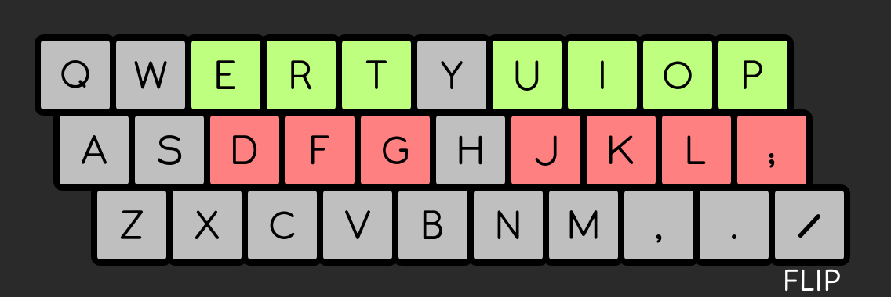
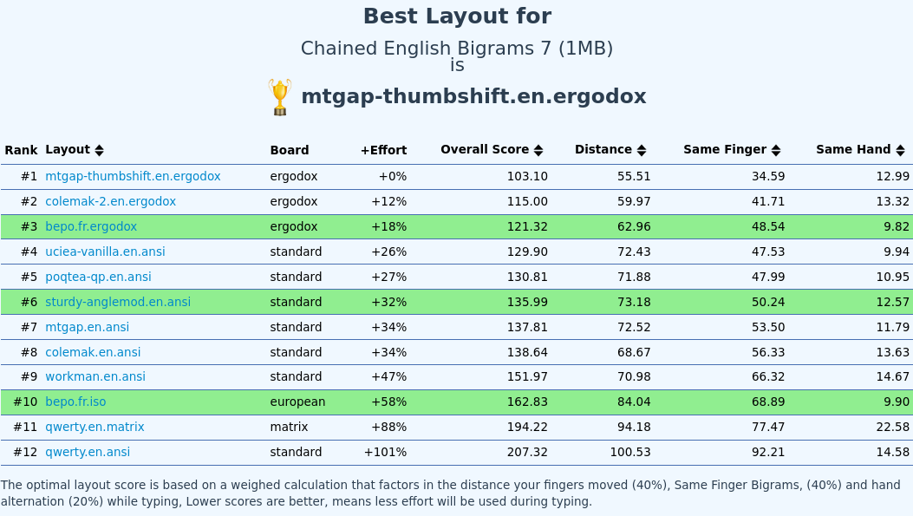

+++
title = "Analyse et optimisation"
date = 2024-11-04T05:00:00+01:00
author = "kaze"
tags = ["communauté", "technique", "outils"]
+++

Optimiser une disposition de clavier, ça consiste en quoi ?

À l’époque de Dvorak et Bépo la réponse était simple, mais ce domaine a
complètement explosé ces 20 dernières années suite au développement de
dispositions anglophones comme Colemak, Workman, MTGAP, ISRT, Sturdy…

Pour que chacun·e puisse comprendre en quoi Ergo‑L se distingue et quels sont
ses avantages et inconvénients par rapport aux autres dispositions de clavier,
il était grand temps d’écrire un article sur l’art délicat de l’analyse et de
l’optimisation des <i lang="en">layouts</i>.

<!--more-->

:::{.highlight style="max-width: 32em;"}
- [Les fondamentaux]
  - [la <i lang="en">heatmap</i>]
  - [la charge des doigts]
  - [les bigrammes]
  - [les trigrammes]
- [Critères d’évaluation]
  - [métriques indispensables]
  - [SHU, <i lang="en">same-hand usage</i> ?]
  - [distance parcourue ?]
  - [note globale ?]
- [Optimiser pour une note globale ?]
  - [l’approche CarpalX]
  - [l’approche Optimot]
  - [une autre note globale est-elle possible ?]
- [Optimiser façon Ergonaute !]
  - [l’état de l’art]
  - [la méthode]
  - [les outils]
  - [la communauté]
- [Les principaux analyseurs]
  - [CarpalX](#carpalx)
  - [KLA (<i lang="en">keyboard layout analyzer</i>)]
  - [Colemak-DH](#colemak-dh)
  - [Oxeylyzer ❤️]
  - [Kalamine 🚀]
- [Conclusion]
:::

Les fondamentaux
--------------------------------------------------------------------------------

Quelles sont les principales caractéristiques d’une bonne disposition de clavier ?

### La <i lang="en">heatmap</i>

L’optimisation la plus évidente pour une disposition de clavier consiste à
placer les touches les plus fréquemment utilisées aux meilleurs emplacements :

- sur les 8 positions de repos
   ([A]{.kbd}[S]{.kbd}[D]{.kbd}[F]{.kbd} et [J]{.kbd}[K]{.kbd}[L]{.kbd}[;]{.kbd} en Qwerty) ;
- sur les 4 positions des majeurs et annulaires de la rangée supérieure
   ([W]{.kbd}[E]{.kbd} et [I]{.kbd}[O]{.kbd} en Qwerty) ;
- sur les 2 positions des index de la rangée inférieure
   ([V]{.kbd} et [M]{.kbd} en Qwerty).

Ces positions correspondent à celles notées 1 à 2 par le projet
[Workman](https://workmanlayout.org/#back-to-the-drawing-board).

On notera au passage que la question de l’accessibilité hors du pavé central de
3×10 touches ne s’est jamais posée chez Workman : le principe [1DFH][] va de soi
pour les dispositions anglophones.

### La charge des doigts

Une autre optimisation de base consiste à équilibrer la charge de travail des
doigts :

- les doigts forts (index, majeur) peuvent supporter plus de charge que les
  auriculaires, qui sont déjà très sollicités avec [Entrée]{.kbd},
  [Backspace]{.kbd}, [Tab]{.kbd}, [Shift]{.kbd}…
- la charge est aggravée par l’utilisation de touches inconfortables,
  c’est-à-dire celles notées 3 ou plus par le projet Workman (voir ci-dessus).

On affiche en bleu la charge liée aux touches notées 1 à 2, en jaune celle des
touches notées 3, et en orange celles notées 4 ou plus — ce qui inclut les
touches trop excentrées pour être évaluées par Workman, et qui enfreignent le
principe [1DFH][], auquel nous autres Ergonautes sommes si attaché·e·s.

](ergol.png)

](bepo.png)

### Les bigrammes

Un bigramme est un enchainement de deux touches.
Tout bigramme appartient à l’une des catégories suivantes :

- alternance de mains : une touche sous chaque main ;
- bigramme de même main : les touches sont sous deux doigts différents d’une
  même main ;
- bigramme de même doigt (SFB, pour <i lang="en">same-finger bigram</i>) : deux
  touches différentes à enchainer avec le même doigt ;
- répétition (SKB, pour <i lang="en">same-key bigram</i>) : la même touche est
  pressée deux fois de suite.

On affiche les SKB en jaune et les SFB (plus gênants) en orange. Le nombre de
SFB dépend fortement de la disposition de clavier, alors que le nombre de SKB
dépend essentiellement du corpus utilisé — mais l’utilisation d’une touche morte
est de nature à augmenter le nombre de SKB. On ne peut jamais gommer
complètement ces SFB et SKB, mais on fait en sorte de les placer
préférentiellement sur les doigts forts, en évitant tout particulièrement les
auriculaires.

](ergol_sfu.png)

](bepo_sfu.png)

Lors d’un enchainement rapide de deux touches, il est fréquent (voire
systématique) que la deuxième touche soit pressée avant que la première ne soit
relâchée. C’est particulièrement vrai pour les bigrammes de même main.

Les bigrammes de même main sont plus délicats à qualifier. On distingue :

- roulement intérieur : l’enchainement se fait confortablement de l’auriculaire
  vers l’index (le meilleur enchainement qui soit) ;
- roulement extérieur : l’enchainement se fait confortablement de l’index vers
  l’auriculaire (confort comparable à une alternance de mains) ;
- ciseau : l’enchainement requiert un changement de rangée inconfortable, comme
  [C]{.kbd}[R]{.kbd} en Azerty ou Qwerty ;
- extensions (LSB, pour <i lang="en">lateral stretch bigram</i>) :
  l’enchainement inclut une touche d’une colonne excentrée ou de la rangée des
  chiffres.

Le taux de SFB (ou SFU, pour <i lang="en">same-finger usage</i>) est le
principal indicateur du niveau d’optimisation d’une disposition de clavier ; on
peut donc être tenté de l’utiliser comme indicateur de qualité générale. Mais
attention, un SFU très bas cache parfois des défauts rédhibitoires ailleurs —
notamment sur les ciseaux, les extensions, ou la charge des doigts.

### Les trigrammes

Les trigrammes sont des enchainements de trois touches. Ils peuvent souvent être
interprétés comme la composition de deux bigrammes distincts : par exemple,
[O]{.kbd}[U]{.kbd}[R]{.kbd} en Qwerty ou Azerty peut être considéré comme la
composition du roulement [O]{.kbd}[U]{.kbd} et de l’alternance
[U]{.kbd}[R]{.kbd}. Cette approximation est suffisante dans la plupart des cas.

On distingue toutefois le cas des roulements de trois touches : enchainer deux
roulements dans le même sens est bien plus efficace que d’enchainer deux
alternances, car on ne fait toujours qu’un mouvement pour actionner les trois
touches plutôt qu’un mouvement par touche.

Inversement, il y a aussi des trigrammes qui produisent des achoppements, et
dont il faut tenir compte de façon spécifique :

- SFS (<i lang="en">same-finger skipgram</i>) : un SFB avec une touche d’un
  autre doigt intercalée au milieu, par exemple [E]{.kbd}[A]{.kbd}[D]{.kbd} ou
  [B]{.kbd}[U]{.kbd}[T]{.kbd} en Qwerty ;
- SKS (<i lang="en">same-key skipgram</i>) : un SKB avec une touche d’un autre
  doigt intercalée au milieu, par exemple [E]{.kbd}[R]{.kbd}[E]{.kbd} ou
  [E]{.kbd}[L]{.kbd}[E]{.kbd} en Qwerty ;
- redirection : enchainement de deux roulements de sens opposés, par exemple
  [S]{.kbd}[A]{.kbd}[D]{.kbd} ou [M]{.kbd}[O]{.kbd}[K]{.kbd} en Qwerty ;

Les SFS et SKS sont bien moins gênants que les SFB et SKB respectivement, mais
ils doivent être pris en compte pour ne pas dégrader le confort de la
disposition.

Les redirections peuvent être acceptables. C’est le cas du mot `avec` tapé en
Ergo‑L, qui correspond à <kbd>A</kbd><kbd>V</kbd><kbd>D</kbd><kbd>W</kbd> en
Qwerty : un roulement intérieur suivi d’un roulement extérieur, avec un pivot
sur l’index. Sans être aussi confortable qu’un simple roulement, ça reste un
mouvement facile et peu sujet à l’erreur. Et plus généralement, on constate que
si l’index intervient dans une redirection (donc soit en début, soit en pivot,
soit en fin d’enchainement), le mouvement est confortable… ou le devient avec un
peu de pratique.

On parle de *mauvaise* redirection quand l’index n’intervient pas dans le
mouvement. C’est le cas de la chaine `uti` en Ergo‑L, qui correspond à
<kbd>;</kbd><kbd>K</kbd><kbd>L</kbd> en Qwerty. Ce type d’enchainement est
inconfortable et très sujet à l’erreur, la pratique n’atténuant que
partiellement la gêne. Et `uti` a beau être sur la <i lang="en">home row</i> en
Ergo‑L, c’est bien moins confortable à taper que `avec`, même si celui-ci
utilise les trois rangées.

Critères d’évaluation
--------------------------------------------------------------------------------

### Métriques indispensables

Un analyseur de disposition de clavier doit, en tout premier lieu, fournir des
métriques sur les principaux critères :

:::{.highlight}
- la <i lang="en">heatmap</i> doit être centrée sur les positions confortables ;
- la charge des doigts doit être bien répartie et épargner les auriculaires ;
- le taux de bigrammes de même doigt (SFU) doit être le plus bas possible ;
- le nombre de ciseaux et d’extensions (LSB) doit être le plus bas possible ;
- le taux de mauvaises redirections doit être le plus bas possible.
:::

**Chacune de ces métriques est importante** : chez les Ergonautes, on considère
que la qualité ressentie d’une disposition est reflétée par sa pire métrique,
voire son pire achoppement, bien plus que par une moyenne (fût-elle pondérée) de
toutes ces métriques.

**Ces métriques sont faites pour mettre en évidence des défauts**, et ne sont
pas de bons <i lang="en">benchmarks</i>. Par exemple, une diposition qui aurait
2 % de SFU serait bien plus confortable qu’une disposition qui n’en aurait que
1 %, mais concentré sur un auriculaire : dans le second cas, la métrique est
meilleure mais un défaut en particulier rend toute la disposition insupportable.
Et c’est pour cela que les bons analyseurs détaillent ce type de métriques par
doigt, et ne se contentent pas d’une valeur moyenne.

Les trois premières métriques sont très consensuelles ; les deux dernières sont
moins souvent prises en considération, mais de notre point de vue c’est une
erreur majeure que de les négliger — et elles deviennent même primordiales pour
les dispositions favorisant les roulements aux alternances de mains.

### SHU, <i lang="en">same-hand usage</i> ?

Le SHU mesure la répartition entre alternances de mains et roulements.

À l’époque des machines à écrire mécaniques, le SHU devait être le plus bas
possible car les roulements coinçaient souvent les marteaux : Qwerty et surtout
Dvorak ont été développés dans cet objectif. C’est aussi le cas de Bépo et de
ses nombreuses variantes.

Mais, de nos jours, les claviers informatiques n’ayant pas de contrainte de ce
type, on ne cherche plus à minimiser cette métrique du SHU : elle permet juste
de voir si une disposition privilégie les alternances de mains ou les
roulements.

On constate même que la plupart des dispositions modernes privilégient les
roulements, qui sont perçus comme plus confortables et moins sujets à l’erreur.
C’est notamment le cas de Workman, qui a grandement inspiré Ergo‑L :

> In designing Workman, I preferred a high SHU (low alternation) over a low SHU
> (high alternation). I think high alternation is beneficial if you’re typing on
> mechanical typewriters but not necessarily on modern keyboards.

> It is much more efficient to ride the momentum of a single arm or wrist stroke
> and type a combo rather than just one key.

— [Kevin DeLoach][kdeloach], disposition [Workman][]

C’est un constat qui a également été fait par certains Bépoètes qui ont proposé
des améliorations très significatives de Bépo. C’est notamment le cas de
l’auteur de Béop :

> La frappe d’un roulement facile peut être plus rapide, plus confortable et
> moins sujette à la faute de frappe qu’une alternance de mains.

— extrait des notes de conception de [Béop][]

Et c’est un sujet qui a été longuement détaillé par [Nuclear Squid][] dans sa
conférence « [Ergonomie clavier : l’ère post-Dvorak][cdl2023-slides] »
([vidéo][cdl2023-video]).

Attention : les dispositions de clavier qui privilégient les roulements prennent
le risque d’avoir un taux élevé de mauvaises redirections.
 
### Distance parcourue ?

Une métrique historique consiste à mesurer la distance parcourue par les doigts
pendant la saisie d’un texte : c’est facile à calculer, et toujours amusant de
savoir combien de kilomètres nos doigts parcourent pour saisir un texte. :-)

CarpalX et KLA l’utilisent toujours, et Claude Marsan l’utilisait déjà en 1991
pour vanter les mérites de sa disposition de clavier :

> Pour 100 000 frappes […], la distance projetée sur un plan horizontal
> parcourue par les doigts est de 1 400 mètres, alors qu’en AZERTY, elle est de
> 3 216 mètres.

— *[La fin de l’AZERTY ?!]*, p. 299

Les analyseurs modernes n’utilisent plus cette métrique, car elle n’est
pertinente que si l’on suppose que tous les déplacements de doigt se valent — ce
qui est totalement faux, comme expliqué dans le paragraphe sur [la <i
lang="en">heatmap</i>].

Corollaire : cette métrique est une très mauvaise cible d’optimisation. À
vouloir réduire la distance parcourue sans distinction de doigts, l’optimum
n’est atteint que quand les auriculaires font autant de distance que les index —
ce qui va grossièrement à l’encontre des objectifs ergonomiques communément
admis.

Cette métrique est amusante, mais à n’utiliser qu’à titre de curiosité !

### Note globale ?

Certains analyseurs de <i lang="en">layout</i> proposent une note globale, qui
est une moyenne pondérée de plusieurs critères plus objectifs. Si vous
connaissez les critères utilisés et êtes d’accord avec leur pondération, cette
note globale peut donner une évaluation générale appréciable lors des premières
phases d’optimisation.

Mais il y a deux choses importantes à garder à l’esprit :

- une note globale ne rend pas compte des pires défauts de la disposition : ils
  sont soit noyés dans la moyenne, soit complètement ignorés ;
- quelle que soit sa qualité, une note globale ne sera jamais une bonne cible
  d’optimisation.

> Lorsqu’une métrique devient un objectif, elle cesse d’être une bonne métrique.

— [loi de Goodhart](https://fr.wikipedia.org/wiki/Loi_de_Goodhart)

Optimiser pour une note globale ?
--------------------------------------------------------------------------------

Ça peut être contre-intuitif, mais optimiser pour une note globale est voué à
l’échec : chercher à atteindre la meilleure valeur va nécessairement dégrader
les métriques qui ne sont pas (ou pas suffisamment) prises en compte par la note
globale.

Pour s’en convaincre, il y a deux exemples assez caricaturaux : CarpalX et
Optimot.

### L’approche CarpalX

S’il existait une note globale pertinente, n’importe quel développeur aurait pu
déterminer une disposition de clavier optimale pour un corpus donné en
appliquant un algorithme de [recuit simulé][].

C’est ce qu’a fait [CarpalX][], qui est le projet le plus ancien et le plus
connu dans le domaine. Sa note globale est un [score d’effort][CarpalX-effort]
qui est basé sur un modèle assez complexe prenant en compte de multiples
critères, notamment :

- l’alternance des mains ;
- le SFU ;
- les roulements ;
- la réduction de la charge des auriculaires ;
- la limitation des enchainements complexes.

CarpalX a ainsi abouti à la disposition [QFMLWY][], qui a le meilleur score
d’effort possible. Et la disposition [Qwerty-Flip][] a un score d’effort quasi
identique à Dvorak, alors qu’elle est très proche de Qwerty — et donc bien plus
simple à apprendre, tout en conservant les raccourcis clavier usuels.

Et pourtant, personne n’utilise ces dispositions. Deux hypothèses :

- soit c’est un simple manque de notoriété : elles sont très bonnes mais trop
  peu connues ;
- soit le score d’effort est une métrique imparfaite, et un très bon score
  d’effort peut masquer des défauts majeurs.

Et de fait : le score d’effort accorde bien trop peu d’importance au SFU. Il
s’élève à 4,6 % pour QFMLWY, bien loin de Dvorak (2,7 %), Colemak (1,6 %) ou
Ergo‑L (1,2 %). Quant à Qwerty-Flip, son SFU est très logiquement le même que
celui de Qwerty, soit 5,7 %. Le résultat est constatable immédiatement, et ce
n’est là que le principal défaut de ces dispositions.

> The CarpalX layout seemed attractive due to its supposed scientific derivation.
> After getting up to 10 WPM, I think I preferred it to Dvorak. It seemed to
> have surprisingly high same finger usage — especially the right index.
> Digrams using A, F, I, and P felt uncomfortable, and common enough to really
> bug me. Seemed like a big oversight to an otherwise great layout.

— [u/fullyassociative]

La démarche de CarpalX est basée sur un [modèle d’effort][CarpalX-effort] très
précis, qui donne l’illusion qu’optimiser pour ce score d’effort aboutira de
façon scientifique à la meilleure disposition possible ; et, intuitivement, on a
envie d’y croire ! On voit ici que bien que cet utilisateur ait rapidement perçu
les principaux défauts de cette disposition, il cherche à minimiser son ressenti
à cause de la confiance qu’inspire cette métrique.

Mais, en pratique, toutes les dispositions issues de ce type d’optimisation ont
des défauts rédhibitoires qui sont noyés dans la moyenne du score d’effort. Ce
score, aussi élaboré soit-il, ne parvient pas à rendre compte de la qualité
d’une disposition.

À l’usage, on a constaté que CarpalX trouvait rapidement des dispositions
correctes avec un SFU pas trop élevé et une bonne répartition de la charge des
doigts, puis qu’à chaque itération il proposait des dispositions marginalement
meilleures pour le score d’effort mais où le SFU se dégradait fortement. On
atteint là les limites de l’optimisation mono-critère.

### L’approche Optimot

S’il existait une note globale pertinente mais que vous n’aviez pas les
compétences requises pour la mise en œuvre d’un algorithme d’optimisation tel
que CarpalX, vous pourriez passer par un analyseur en ligne qui propose une
évaluation similaire ; et, à force d’essais, vous obtiendriez une disposition
très bien notée pour votre langue cible — probablement le français, si vous
lisez cet article.

C’est l’approche retenue par Optimot, une variante non libre de Bépo.
Étonnamment, l’analyseur retenu est [KLAnext][], qui est [loin d’être le plus
abouti][les principaux analyseurs]. Ayant optimisé sa disposition pour KLAnext,
l’auteur d’Optimot affirme ainsi que sa disposition est la meilleure en
français, puisque c’est celle qui a la meilleure note sur KLAnext.

Faisons abstraction du raisonnement circulaire et intéressons-nous à l’anglais :
dans cette langue, Optimot a une note KLAnext quasi équivalente à celle de
Colemak et MTGAP, qui sont deux des meilleures dispositions anglophones
modernes. Comment est-ce possible, alors qu’Optimot dédie beaucoup de bonnes
touches aux lettres accentuées du français ? Et alors que son auteur confirme
que l’anglais n’est qu’un objectif secondaire de cette disposition ?

> Je peux modifier légèrement Optimot pour optimiser un peu plus pour l’anglais
> (mais au détriment du français). Mais ce n’est pas mon choix parce que nous
> sommes en France et que je m’adresse à des personnes qui écrivent d’abord en
> français.

— Pyjam, auteur d’Optimot

Là encore, deux hypothèses sont envisageables :

- soit les meilleurs auteurs de dispositions anglophones qui ont travaillé le
  sujet au cours des vingt dernières années sont totalement incompétents ;
- soit la note globale de KLAnext comporte des failles trop importantes pour
  rendre compte de la qualité d’une disposition.

Fatalement, la deuxième hypothèse est de loin la plus probable. Et de fait, la
note globale de KLAnext comporte des failles évidentes.

- Elle *pénalise* les roulements, qui sont pourtant les meilleurs enchainements
  possibles sur un clavier informatique. Optimiser pour KLAnext suppose donc de
  *casser* les roulements et ainsi de *dégrader* la disposition.
- Elle ne pénalise ni les extensions de doigts, ni les ciseaux : le `EN`
  d’Ergo‑L et le `WH` de Bépo (<kbd>D</kbd><kbd>F</kbd> et
  <kbd>]</kbd><kbd>.</kbd> en Qwerty) ont la même pénalité, alors qu’il s’agit
  respectivement du meilleur et du pire enchainement possible. Optimiser pour
  KLAnext fait privilégier les *ciseaux* aux roulements.
- Elle ne semble pas prendre en compte l’équilibre de la charge des doigts :
  Optimot a une charge de plus de 11 % sur l’auriculaire droit en français, ce
  qui est exceptionnellement élevé pour une disposition de clavier (ergonomique
  ou non), et souvent rédhibitoire. Un travers de la [distance parcourue ?]
- Elle est plus sensible à la géométrie du clavier qu’à la disposition des
  touches. Ainsi, pour l’anglais, Bépo sur Ergodox a une meilleure note que
  Sturdy sur ANSI — s’agissant là respectivement de la pire et de la meilleure
  disposition qui soient pour cette langue, cette note ne traduit pas du tout
  l’écart de confort ressenti.

Le cas de KLAnext est un peu caricatural, mais à mon sens le problème ne vient
pas tant de l’analyseur que du mésusage de sa note globale : elle peut donner
une première appréciation générale, mais elle n’est pas une bonne cible
d’optimisation.

Tout ceci n’invalide pas les qualités d’Optimot : comme on le dit dans notre
[comparateur][], cette disposition reste une belle amélioration de Bépo pour le
même objectif, écrire en français sur un clavier standard. Mais elle n’est [pas
optimisée pour l’anglais][optimot-en], comme le reconnait son auteur à juste
titre ; et, si l’optimisation basée sur KLAnext a permis de réduire
significativement le SFU, elle n’a pas permis de corriger ni le nombre de
ciseaux, ni le mauvais équilibre de la charge des doigts, ni le [manque de
compatibilité avec les claviers compacts][adaptations], trois défauts hérités de
Bépo mais ignorés par KLAnext.

### Une autre note globale est-elle possible ?

Après avoir constaté que les notes globales de CarpalX et KLA/KLAnext étaient
mauvaises, j’ai longtemps été persuadé qu’il devait *forcément* y avoir une
bonne métrique globale ailleurs.

Mais, à l’usage, on s’est rendu compte que toute note globale présentera les
mêmes défauts :

- c’est une notation très subjective, puisque la pondération des différents
  critères change complètement le résultat ;
- ce n’est pas une bonne cible d’optimisation, car cela pousse à négliger les
  défauts peu punis par la notation ;
- ce n’est pas un bon critère d’évaluation non plus, une disposition pouvant
  avoir un défaut rédhibitoire sans que cela affecte la note globale.

Durant la conception d’Ergo‑L, on a perdu beaucoup de temps à tenter des
optimisations mono-critères avec un [algorithme génétique][] ou de [recuit
simulé][]. Certains outils plus aboutis comme <i lang="en">[Keyboard Layout
Optimizer][KLO]</i>, qui a été utilisé pour Neo2, nous semblaient prometteurs ;
mais, à l’usage, ils ont été bien moins utiles que de simples boucles pour
explorer des possibilités par force brute, que [Nuclear Squid][] a codées vite
fait.

> Les chiffres sont aux analystes ce que les lampadaires sont aux ivrognes :
> ils fournissent bien plus un appui qu’un éclairage.

— Jean Dion

Il faut se méfier quand une note globale est mise en avant plutôt que des
métriques objectives, car c’est souvent une façon (délibérée ou non) de passer
sous silence les pires aspects d’une disposition de clavier. Et ça devient
franchement trompeur quand la disposition a été optimisée pour cette note
globale.

Optimiser façon Ergonaute !
--------------------------------------------------------------------------------

Comme on vient de le voir, ce n’est pas tant l’analyseur que son utilisation qui
est en cause : vouloir évaluer ou optimiser des dispositions à l’aune d’une note
globale est voué à l’échec. Il faut procéder autrement.

### L’état de l’art

Avant de se lancer dans l’élaboration d’une disposition de clavier, il est
vivement recommandé de chercher un maximum d’informations sur le sujet. Les
mille et une variantes de Bépo qui ont fleuri laissent penser que la plupart des
adeptes francophones d’ergonomie clavier sont restés sur les principes Dvorak,
qui, datant des années 1930, concernaient les machines à écrire.

Or, beaucoup de choses ont changé depuis une petite vingtaine d’années, avec
notamment : 

- des dispositions de clavier basées non plus sur l’alternance de mains, mais
  sur les roulements — Colemak a ouvert la voie, suivie de bien d’autres ;
- les [claviers compacts][] et l’approche [1DFH][], qui réduisent drastiquement
  les mouvements de doigts ;
- des analyseurs qui, utilisés avec soin, permettent de sortir de l’évaluation
  « au doigt mouillé ».

On essaye de regrouper et vulgariser un maximum d’informations à ce sujet sur ce
site et sur le [serveur Discord][], en espérant que ça puisse aider les auteurs
et autrices de dispositions. Côté anglophone, [r/KeyboardLayouts][] et le
[Keyboard Layouts doc][] sont des mines d’or.

### La méthode

Elle repose sur deux idées fortes :

> Quelle que soit la disposition de clavier, son pire défaut se ressentira
> toujours plus que ses meilleures qualités.

— crédo ergonaute

> Soyez pas cons : ayez des stats.

— [Ergonomie clavier : l’ère post-Dvorak][soyez pas cons]

C’est l’approche qu’on propose sur notre [comparateur][] et qu’on a suivie
pendant toute la mise au point d’Ergo‑L. On a itéré comme suit :

1. Identifier le pire achoppement de la disposition (SFB, ciseau, redirection…).
2. Améliorer notre analyseur pour qualifier et mesurer cet achoppement.
3. Trouver une modification du <i lang="en">layout</i> qui, sur la foi de
   l’analyseur, réduise cet achoppement.
4. Utiliser ce <i lang="en">layout</i> jusqu’à détecter un autre achoppement
   (généralement moins grave).
5. `GOTO 1`.

**On n’a donc jamais eu aucun usage d’une note globale.**
Au contraire, on regarde toujours la pire note et les pires enchainements pour
évaluer une disposition et proposer des améliorations.

Cela dit, il y a bien une métrique que l’on regarde plus que les autres, c’est
le SFU : ça donne assez rapidement une idée de la marge d’optimisation qui
reste. Pour autant, et même si on est très fièr·e·s du SFU d’Ergo‑L en français
comme en anglais, ça n’est pas un objectif en soi : [Nuclear Squid][] a même
rejeté des expérimentations qui avaient des SFU incroyablement bas, mais qui
causaient d’autres problèmes plus sournois à l’usage.
 
C’est notamment le cas d’une expérimentation qu’on a faite un peu par accident
sur la fin du projet Ergo‑L, et qui est devenue [Colemak French Touch][]. Le SFU
était terrifiant (0,7 %) et le fait de coller à une disposition très connue
était un avantage auquel on était sensible, à tel point qu’on a envisagé
d’annuler la sortie (alors imminente) d’Ergo‑L 1.0 ! Mais deux problèmes sont
apparus assez vite :

- la charge des doigts était trop déséquilibrée, surtout en anglais
  étrangement ;
- la redirection `OUI` était *très* inconfortable. Et on est retombés sur une
  conclusion qui nous était déjà apparue plus tôt dans le projet : soit on
  répartit ces trois lettres sur les deux mains, soit il faut que l’une des
  trois soit sous un index.

On constate que les enchainements inconfortables évoluent de deux façons
possibles avec la pratique : soit ils deviennent acceptables, soit ils se
révèlent insupportables. D’où l’intérêt de pratiquer la disposition qu’on
utilise — et, idéalement, d’être plusieurs personnes à pratiquer. Les zones
d’inconfort sont propres à chacun·e d’entre nous, et cela peut dépendre autant
de la personne que du type de clavier.

En ce qui me concerne, mes premiers tests d’Ergo‑L remontent à la version 0.7,
qui ne diffère que très légèrement d’Ergo‑L 1.0. Et, bien qu’Ergo‑L 0.7 ait des
métriques excellentes, le bigramme `if` (<kbd>L</kbd><kbd>P</kbd> en Azerty ou
Qwerty) m’était très inconfortable. Ergo‑L avait beau être meilleur que
Lafayette *dans l’ensemble*, le fait qu’il soit pire sur un point aussi
désagréable me dissuadait totalement de changer de disposition. Le problème a
été résolu par [Moussx][] avec une permutation de trois touches : ça peut
paraitre anecdotique, mais ça a *complètement* changé mon expérience de cette
disposition de clavier.

Il faut évidemment avoir des stats solides, et savoir les faire évoluer tout au
long de l’optimisation d’une disposition de clavier ; mais il nous semble tout
aussi essentiel d’alterner entre des phases d’optimisation et des phases
d’expérimentation pour mettre en lumière les enchainements inconfortables… et
les résoudre.

### Les outils

Les itérations de développement ont été facilitées par :

- [x‑keyboard][], pour tester nos <i lang="en">layouts</i> ;
- [kalamine][], pour générer et installer les pilotes ;
- [notre analyseur maison](/stats).

On a développé notre propre analyseur pour plusieurs raisons :

- aucun analyseur existant ne prenait en compte les touches mortes, alors que
  toutes les dispositions francophones en font usage — et c’est même un élément
  fondamental d’Ergo‑L ;
- au fur et à mesure de l’avancement du projet, on a voulu mettre en lumière
  certains défauts de la disposition qui n’étaient pas toujours pris en compte
  par les autres analyseurs : part des extensions dans la charge des doigts,
  qualification des redirections, repérage des ciseaux…
- x‑keyboard, qui avait été développé bien plus tôt, avait déjà beaucoup des
  fonctionnalités requises pour développer un analyseur ;
- c’était simple et fun à faire. :-)

Bien évidemment, on a vérifié que, pour un même <i lang="en">layout</i> et un
même corpus, notre analyseur donnait les mêmes résultats que les analyseurs
existants. Et, bien sûr, tout est disponible sous licence libre pour que
chacun·e puisse étudier, modifier, utiliser et rediffuser le tout comme bon lui
semblera.

Outre les métriques, cet analyseur a pour but de lister tous les bigrammes et
trigrammes qui peuvent causer de l’inconfort. Ce n’est pas tant un <i
lang="en">benchmark</i> qu’un outil d’optimisation.

### La communauté

Faire une disposition de clavier pour soi-même est relativement aisé ; en faire
une qui convienne au plus grand nombre, c’est une autre histoire.

En particulier, on a tou·te·s des niveaux de tolérance différents à certains
défauts de <i lang="en">layout</i> : pour moi les extensions d’auriculaire sont
particulièrement pénibles, alors que d’autres préfèrent ça plutôt que d’utiliser
AltGr ; certain·e·s s’accommodent bien des ciseaux (notamment les adeptes de
claviers 3D), d’autres pas du tout ; et les mauvaises redirections sont le point
le plus clivant : certain·e·s s’y font, mais beaucoup trouvent ça rédhibitoire à
l’usage.

Pour prendre en compte toutes ces particularités, notre analyseur ne se contente
pas de mesurer chaque type d’achoppement mais les détaille en listant tous les
bigrammes et trigrammes pouvant poser problème. Ça nous a fait gagner beaucoup
de temps en facilitant les échanges de la communauté des Ergonautes pendant le
développement d’Ergo‑L.

Les principaux analyseurs
--------------------------------------------------------------------------------

Notre analyseur n’est ni le premier, ni le dernier à être développé. Petit tour
d’horizon des autres analyseurs parmi les plus connus et les plus utiles.

### CarpalX

[CarpalX][] est un analyseur et optimiseur en Perl, proposé par [Martin
Krzywinski][] sous licence non libre (CC-BY-NC-SA 4.0). Le [code
source][CarpalX-source] est disponible sur son site, la dernière modification
(version 0.12) remonte à 2015.

CarpalX a un intérêt historique mais, comme [mentionné plus haut][l’approche
CarpalX], son score d’effort ne permet pas de fournir une évaluation fiable,
loin de là. Il a globalement été une perte de temps pour le développement
d’Ergo‑L.

### KLA (<i lang="en">Keyboard Layout Analyzer</i>)

[KLA][] est un analyseur libre en PHP et JavaScript, proposé par [Patrick
Gillespie][patorjk] sous licence libre (MIT). Le [code source][KLA-source] est
disponible sur GitHub, la dernière modification remonte à 2019.

[KLAnext][] est un fork non libre de KLA par [Ian Douglas][]. Ce fork est
lui-même dérivé de [KLAtest][] ([source][KLAtest-source]) par [Xay Vong][],
alias Shena’Fu ou Den. Sans accès au code, difficile d’évaluer ce qu’apporte
KLAnext à l’original — mais, comme évoqué plus haut, il ne nous semble pas
pertinent. C’est en référence aux failles de KLAnext que la plaisanterie
« *[Qwerty-Lafayette est le meilleur <i lang="en">layout</i> du
monde !][lafayette_mldm]* » est devenue récurrente dans la communauté ergonaute.
:-)

Plus intéressant, [SteveP][] a développé un [fork libre de KLA][KLA-SteveP]
([source][KLA-SteveP-source]) et détaille précisément les [corrections
apportées][KLA-SteveP-about] :

- le calcul de distance parcourue est remplacé par une évaluation de *pénalité*
  de distance, qui est pondérée par doigt pour prendre en compte la [loi de
  Fitts][] — ça n’est pas aussi poussé que ce que proposent Workman ou
  Colemak-DH, mais c’est déjà un progrès très significatif ;
- le SHU n’est plus du tout pris en compte dans le calcul de la note globale, si
  bien que les roulements ne sont plus considérés comme une pénalité. Enfin !

Chaque variante de KLA a ses propres paramètres de pondération pour la note
globale, qui est par nature très subjective. On recommande d’ignorer cette note.

Le fork de SteveP propose des métriques plus saines que KLAnext. À notre
connaissance, c’est la version de KLA la plus utilisée. C’est aussi la version
qui a été la mieux maintenue : son développement ne s’est arrêté qu’en mai 2021.

Toutefois, sur les [5 critères indispensables][métriques indispensables] à nos
yeux, seul le SFU est analysé par KLA. Attention à ne pas perdre de vue les 4
autres !

### Colemak-DH

[Colemak-DH][] est un projet qui a enthousiasmé beaucoup d’anglophones, à juste
titre : c’est une belle amélioration de Colemak, qui lui confère un beau
rééquilibrage de la <i lang="en">heatmap</i>, proche de celle de Workman (qui
fait office de référence dans ce domaine), tout en réduisant significativement
les extensions latérales (LSB).

Et comme c’est un projet d’ampleur, ses contributeurs — dont un certain SteveP —
ont développé [un analyseur][Colemak-DH-analyzer] qui reflète les choix de cette
disposition, notamment la recherche de bons roulements et d’une bonne
répartition de la charge des doigts. Le [code source][Colemak-DH-source] (JS) de
cet analyseur est disponible sous licence libre (CC0).

C’est un analyseur plus complet que KLA, qu’il semble avoir remplacé — au moins
auprès des développeurs qui y ont contribué. Le dernier commit remonte à juin
2022.

![Accessibilité des touches selon [Colemak-DH].](colemak_dh_effort.png)

Il remplace la mesure de distance parcourue par une évaluation globale de la <i
lang="en">heatmap</i> basée sur un [score d’effort][Colemak-DH-effort] associé à
chaque touche, selon un modèle plus précis que celui de Workman (qui vise
surtout à être un ordre de grandeur pour les humains). Le résultat est
intéressant, bien plus pertinent qu’une mesure de distance parcourue, mais reste
assez subjectif — et donc débattable en tant que <i lang="en">benchmark</i>.

Contrairement à KLAnext, il introduit la notion de roulement sous la forme de
« bigramme de doigts voisins », une notion plus restrictive que la définition
du roulement qu’on propose ici, et qui, étrangement, exclut l’index —
probablement pour éviter de favoriser les LSB, un défaut rédhibitoire chez
Colemak dont Colemak‑DH cherche a se débarrasser.

**Attention** : les ciseaux ne sont pas pris en compte par cette métrique, ce
qui peut donner des résultats surprenants ! Aucun souci sur Colemak-DH, puisque
c’est une variante de Colemak, qui fait déjà très attention aux ciseaux ; mais
c’est susceptible d’être une source d’erreurs si on utilise cet analyseur sur
d’autres dispositions. Par exemple, les bigrammes `SH` et `YO` d’Optimot
([K]{.kbd}[>]{.kbd} et [X]{.kbd}[E]{.kbd} en Qwerty) sont considérés comme les
deux meilleurs roulements de cette disposition (en anglais), alors qu’il s’agit
en fait de deux de ses pires ciseaux.

### Oxeylyzer ❤️

[Oxey][] est un auteur de dispositions de clavier très reconnu, notamment pour
[Sturdy][] qui est d’une efficacité redoutable en anglais : un SFU très bas
(0,9 %), beaucoup de roulements, très peu de ciseaux. Du grand art !

Oxey propose aussi un analyseur très complet avec [Oxeylyzer][], dont le [code
source][oxeylyzer-source] (Rust) est disponible sous licence libre (Apache 2.0).
Cet « Oxeylyzer » est à nos yeux le meilleur analyseur du moment :

- des métriques précises, complètes et pertinentes : sa notion de « mauvaises »
  redirections, notamment, nous a été très utile ;
- facile à interpréter grâce aux codes de couleur (vert, c’est bien ; rouge,
  c’est mal) ;
- pas de note globale (tant mieux !), mais efficace pour vite repérer les points
  faibles d’une disposition ;
- très pratique pour tester des permutations de touches.

![<i lang="en">Heatmap</i> anglophone de Sturdy dans
[Oxeylyzer].](oxeylyzer.png)

Contrairement à Colemak-DH, aucune métrique d’ensemble ne cherche à qualifier la
<i lang="en">heatmap</i> : elle est mise en avant telle quelle, c’est simple et
objectif.

Oxeylyzer est limité aux dispositions [1DFH][] (3×5 touches par main), ce qui
nous semble très pertinent d’un point de vue ergonomique, mais ça serait un
inconvénient pour des dispositions du type Bépo, qui font le choix d’étaler les
lettres sur deux colonnes supplémentaires afin de moins recourir aux touches
mortes.

C’est vraiment l’analyseur de référence pour nous. On le recommande vivement !
Et le projet est activement maintenu, le dernier commit datant de moins de 6
mois à l’heure où j’écris ces lignes.

### Kalamine 🚀

[Kalamine][] est avant tout le générateur de pilotes que l’on a développé pour
Qwerty-Lafayette et Ergo‑L ; mais, au fil du temps, il s’est transformé en outil
de mise au point tout-en-un pour les auteurs et autrices de dispositions de
clavier. L’analyseur d’Ergo‑L vient ainsi d’être intégré à Kalamine, ce qui
permet de visualiser directement l’impact de chaque modification de <i
lang="en">layout</i>.

Le générateur est écrit en Python, l’analyseur en JavaScript, et l’ensemble du
code source est proposé sous licence libre (MIT).

![<i lang="en">Heatmap</i> francophone d’Ergo‑L dans
[Kalamine].](/presentation/ergol_fr.svg)

Il n’est pas encore au niveau d’Oxeylyzer mais il a pour nous des avantages
importants, notamment :

- l’intégration de [x‑keyboard][] pour visualiser la disposition et tester
  rapidement une modification sans avoir à l’installer ;
- et surtout, le support des touches mortes ! À notre connaissance, c’est le
  seul analyseur qui dispose de cette fonctionnalité.

On espère qu’en mettant [notre analyseur maison](/stats) à disposition dans
Kalamine il pourra servir à d’autres projets qu’Ergo‑L et les dispositions de la
famille Lafayette. Et il est toujours en développement actif, notamment pour les
projets Erglace et Hypergol.

Conclusion
--------------------------------------------------------------------------------

- Il n’y a pas de mauvais analyseur, juste des mauvaises façons de s’en servir.
- Il n’y a pas de bonne note globale, ni de bonne façon de s’en servir.
- Chaque métrique est importante, car on a toutes et tous nos préférences et nos
  ressentis :

:::{.highlight}
- la <i lang="en">heatmap</i> doit être centrée sur les positions confortables ;
- la charge des doigts doit être bien répartie et épargner les auriculaires ;
- le taux de bigrammes de même doigt (SFU) doit être le plus bas possible ;
- le nombre de ciseaux et d’extensions (LSB) doit être le plus bas possible ;
- le taux de mauvaises redirections doit être le plus bas possible.
:::

Une dernière recommandation : l’ergonomie passe avant l’optimisation. Quand on
dit qu’Ergo‑L est « [ergonomique avant tout](/) », ça n’est pas un simple
slogan, c’est *littéralement* ce qu’on a fait : *d’abord* caler l’ergonomie
([1DFH], raccourcis clavier…), *puis* optimiser les mouvements de doigts.

Un grand merci à [Nuclear Squid][], non seulement pour avoir initié et dirigé le
projet Ergo‑L, mais plus prosaïquement pour sa contribution à la rédaction des
chapitres sur les métriques et les analyseurs. Que le Grand Palmipède parsème
son chemin de pétales de roses.

Merci aussi à [Moussx][], [Meriem][], [aurelberra][], [Adrienm7][], [Ju__][],
[Xiloynaha][] et [Chouhartem][] pour la relecture, les suggestions et les
corrections : on a eu plus de 400 points de discussion pour boucler cet article,
sans compter les échanges sur Discord. Gros boulot ! La communauté des
Ergonautes est fantastique. 🚀

[1DFH]:                    /presentation/#dfh-1u-distance-from-home
[Erglace]:                 /erglace
[Colemak French Touch]:    /lafayette/#colemak-french-touch
[claviers compacts]:       /claviers/compacts
[comparateur]:             /alternatives/#tableau-comparatif
[optimot-en]:              /alternatives/#bépo-et-ses-variantes
[adaptations]:             /claviers/#les-limitations-de-bépo-béopy-optimot
[cdl2023-slides]:          /slides/capitoledulibre2023
[cdl2023-video]:           https://www.youtube.com/watch?v=96RikfmBY-U
[soyez pas cons]:          https://www.youtube.com/watch?v=96RikfmBY-U&t=2017s
[serveur Discord]:         https://discord.gg/5xR5K3nAFX

[x‑keyboard]:              https://github.com/OneDeadKey/x-keyboard
[kalamine]:                https://github.com/OneDeadKey/kalamine

[Qwerty-Lafayette]:        https://qwerty-lafayette.org
[lafayette_mldm]:          https://mastodon.social/@fabi1cazenave/111806300874072301
[Workman]:                 https://workmanlayout.org/#same-hand-utilization-shu
[La fin de l’AZERTY ?!]:   https://www.persee.fr/doc/linx_0246-8743_1991_hos_4_1_1206
[Colemak-DH]:              https://colemakmods.github.io/mod-dh
[Colemak-DH-analyzer]:     https://colemakmods.github.io/mod-dh/analyze.html
[Colemak-DH-effort]:       https://colemakmods.github.io/mod-dh/model.html
[Colemak-DH-source]:       https://github.com/ColemakMods/mod-dh/tree/gh-pages
[Oxey]:                    https://oxey.dev
[Sturdy]:                  https://oxey.dev/sturdy
[Oxeylyzer]:               https://oxey.dev/playground/
[Oxeylyzer-source]:        https://github.com/O-X-E-Y/oxeylyzer
[Béop]:                    http://beop.free.fr/index.php/Main/Pourquoi#Roulements
[recuit simulé]:           https://fr.wikipedia.org/wiki/Recuit_simulé
[algorithme génétique]:    https://fr.wikipedia.org/wiki/Algorithme_génétique
[CarpalX]:                 https://mk.bcgsc.ca/carpalx/
[CarpalX-source]:          https://mk.bcgsc.ca/carpalx/?download_carpalx
[CarpalX-effort]:          https://mk.bcgsc.ca/carpalx/?typing_effort
[QFMLWY]:                  https://mk.bcgsc.ca/carpalx/?full_optimization
[Qwerty-Flip]:             https://nick-gravgaard.com/qwerty-flip
[KLA]:                     https://patorjk.com/keyboard-layout-analyzer
[KLA-source]:              https://github.com/patorjk/keyboard-layout-analyzer
[KLAnext]:                 https://klanext.keyboard-design.com
[KLAtest]:                 https://klatest.keyboard-design.com
[KLAtest-source]:          https://bitbucket.org/Shenafu/keyboard-layout-analyzer
[KLA-SteveP]:              https://stevep99.github.io/keyboard-layout-analyzer/
[KLA-SteveP-about]:        https://stevep99.github.io/keyboard-layout-analyzer/#/about
[KLA-SteveP-source]:       https://github.com/stevep99/keyboard-layout-analyzer
[loi de Fitts]:            https://fr.wikipedia.org/wiki/Loi_de_Fitts
[KLO]:                     https://github.com/dariogoetz/keyboard_layout_optimizer
[r/KeyboardLayouts]:       https://www.reddit.com/r/KeyboardLayouts/
[Keyboard Layouts doc]:    https://docs.google.com/document/d/1Ic-h8UxGe5-Q0bPuYNgE3NoWiI8ekeadvSQ5YysrwII/

[Nuclear Squid]:           https://github.com/Nuclear-Squid
[Moussx]:                  https://github.com/gagbo
[Meriem]:                  https://mastodon.xyz/@meriem
[Adrienm7]:                https://hypertexte.beseven.fr
[aurelberra]:              https://github.com/aurelberra
[Xiloynaha]:               https://github.com/cypriani
[Ju__]:                    https://github.com/PetitWombat
[Chouhartem]:              https://github.com/Chouhartem

[kdeloach]:                https://github.com/kdeloach
[patorjk]:                 https://patorjk.com/
[SteveP]:                  https://github.com/stevep99
[Martin Krzywinski]:       https://mk.bcgsc.ca/
[Xay Vong]:                https://bitbucket.org/Shenafu
[Ian Douglas]:             https://github.com/iandoug
[u/fullyassociative]:      https://www.reddit.com/r/Colemak/comments/643uq4/tried_dvorak_carpalx_qgmlwy_and_now_colemak/
